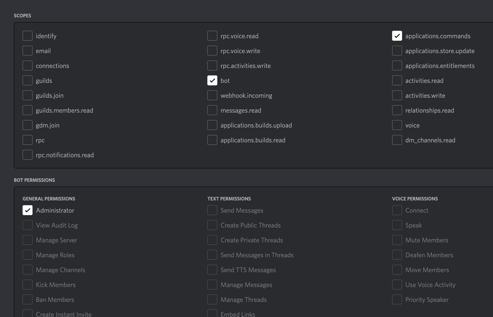

# OSCAR

🤖 `Open Source Community Assistance Robot` 🤖

OSCAR is a Discord bot built to assist the [Open-Source Hub community](https://opensourcehub.io).

- 🔧 Manage OSCAR in the [Discord developer dashboard](https://discord.com/developers/applications)
- 👩🏿‍💻 Check out [Open Source Hub repository](https://github.com/Codesee-io/opensourcehub)
- 👾 Visit the [Discord channel](https://discord.gg/opensource)

## Discord commands

- `/verify`: checks that the caller is the maintainer of at least one project on opensourcehub.io. If so, that user will receive the role of "Maintainer".

## Local development

### Requirements

OSCAR runs on [Node 16](https://nodejs.org/en/download/) and recommends [Yarn](https://classic.yarnpkg.com/lang/en/docs/install/) for dependency management.

OSCAR also requires environment variables to connect to the right services. Create a `.env` at the root of your directory, and add the variables defined in the [.env.sample](.env.sample) file.

### Setup steps

1. Clone the repository to your computer
2. Navigate into the cloned directory
3. Run `yarn install` to install the necessary dependencies
4. Run `yarn dev` to start OSCAR

## Deployment

OSCAR is deployed as a web worker to Heroku.

### First-time setup

1. Install the [Heroku CLI](https://devcenter.heroku.com/articles/heroku-cli#install-the-heroku-cli) on your machine. You can check whether the CLI is installed correctly by running:

```
heroku -v
```

2. Add the Heroku remote. This will ask you to log in to Heroku, which you can do using the credentials in 1Password.

```
heroku git:remote -a oscar-discord
```

### Upload new code to the server

Run the following command to deploy your code to Heroku:

```
yarn deploy
```

This is an alias for:

```
git push heroku main
```

### Uploading commands to the server

When we add new commands or update their name, we need to upload the latest commands **to each server that uses the bot**.

This is done with the following code:

```js
const commands = [
  new SlashCommandBuilder()
    .setName("verify")
    .setDescription(
      "Grants the Maintainer role for maintainers of repositories listed on opensourcehub.io"
    ),
].map((command) => command.toJSON());
```

See [`src/setup-commands.ts`](./src/setup-commands.ts) for the source.

We've provided a shell command that executes that code using 3 arguments:

- `-t`: the bot token
- `-a`: the application id (aka "client id")
- `-g`: the guild id (aka "server id")

For example:

```
yarn upload:commands -t 'bot.token.goes.here' -a 'application_id' -g 'guild_id'
```

### Debugging

Tail the Heroku logs locally:

```
heroku logs --tail
```

## Adding OSCAR to a server

OSCAR is not listed in the Discord Bot directory because we want to control where it is installed. So for now, it needs to be added to servers manually.

Visit the [Discord Developer Portal](https://discord.com/developers/applications/), choose the OSCAR application, then navigate to "OAuth2" > "URL Generator".

There, you'll need to check 2 scopes and 1 permission:

1. scope: bot
2. scope: application.commands
3. permission: Administrator



Then, copy the generated URL at the bottom and paste it in your browser. Discord will take you through the rest of the process.
